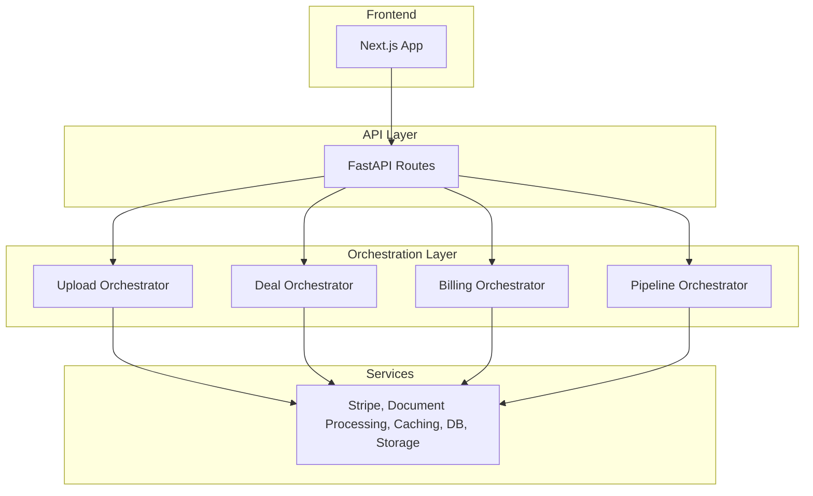

Let me introduce you to **DealQ**, the AI workflow platform I built for commercial real estate investors.

I wrote this blog post to show the technical decision-making and problem-solving that went into building this codebase, what I've learned from the process, and how I'd approach things differently next time.

As the sole technical co-founder, I architected and coded the platform into production, from schema design to web app design to infra, and it was being used by multiple enterprise customers during our private beta. It was built with scale and future feature shipments in mind. The company has since wound down for reasons outside the scope of this article and I am no longer shipping feature updates.

With that being said, let's jump in.

Jump to:
1. [What is DealQ](#what-is-dealq)
2. [Technical Challenges / Accomplishments](#technical-challenges--accomplishments)
3. [Tech Stack](#tech-stack)
4. [System Architecture](#system-architecture)
5. [Technical Accomplishment: Rent Roll Pipeline](#rent-roll-pipeline-design)
6. [Areas For Improvement](#areas-for-improvement)

## What is DealQ

The original vision for DealQ was a platform where CRE (commercial real estate) investors could access AI powered workflows to solve the most mundane and time-intensive due diligence tasks. Particularly, the one we chose to solve first is deal screening / underwriting.

**What that means to you as someone who probably doesn't know anything about real estate**:

A CRE investor typically receives dozens of deals per week. There are three primary documents per deal, all of which are highly variable and messy, usually PDF or Excel files, namely:

1. The offering memorandum - a 20-40 page unstructured PDF which contains the investment narrative and high-level financial info.

2. The rent roll - multi-page document that contains all the unit data and rents of the property

3. The trailing twelve statement - essentially an income statement for the last twelve months at the property

Every real estate firm has highly paid analysts that extract and structure data from the above docs and insert them into the firm's proprietary Excel-based financial model. This process takes anywhere from 30 minutes to multiple hours per property. DealQ's underwriting workflow cut this process down to under 10 minutes.

## Technical Challenges / Accomplishments

I'd say there were two main buckets in terms of technical challenges / accomplishments for this codebase. Below, I'll write high-level what they were and the solutions I designed for them.

### 1. **LLM-Powered Data Extraction Across Inconsistent Document Formats**
- **The Challenge**: Customers need 100% accurate data in financial modelling. I needed to extract large chunks of messy numerical data from highly variable PDFs using LLMS while preventing hallucinations, missing information, managing context rot, and maintaining speed.
- **Solution**: On the backend, I built a multi-stage pipeline utilizing a strategic mix of deterministic methods (regex patterns, structured parsing) and LLMs for intelligent data structuring, with concurrent processing for speed. On the frontend, I built a workflow that lets investors see the structured data output, compare accuracy against the source documents side-by-side and make changes if needed (our extraction accuracy during the beta was 99% across ~300 deals we tested).

### 2. **Production-Ready Infrastructure**
- **Challenge**: Architecting a scalable, maintainable, and fault-tolerant system ready for enterprise customers for the first time. Prior to DealQ, my engineering focus had been mobile consumer applications.
- **Solution**: I deployed a containerized application with Docker, deployed on Digital Ocean with Caddy reverse proxy, CI/CD with GitHub Actions, optimistic upload patterns, background workers, RLS and rigorous authentication, type safety on frontend/backend, and async processing pipelines. I designed a modular architecture that could easily convert our human-in-the-loop workflows into agentic tool calls (more on this later).

## Tech Stack

Now, a quick overview of the tech stack.

### Backend
FastAPI (Python), LangChain for coordinating LLMs, PyMuPDF for reading docs, Redis for caching, OpenPyXl for working with excel files, Supabase for DB and storage, Stripe for billing

### Frontend
Next.js, Zustand, Tailwind, AG-grid for table views, Shad-cn / radix for primitives, Supabase auth

### Infra
Docker, Digital Ocean, Caddy, Github actions for ci/cd

## System Architecture

## Architecture

### 1. Backend Architecture

The backend follows a clean separation of concerns:
- **Routes** → **Orchestrators** → **Services**

**Routes** are thin and only handle HTTP concerns - parsing requests, validating input, and passing data to orchestrators.

**Orchestrators** coordinate business logic by calling multiple services. For example, when processing a deal upload, the Upload Orchestrator coordinates the Document Processing Service (PDF/Excel extraction), AI Service (data structuring), and Storage Service (file management).

**Services** are pure, stateless functions that handle specific domains. Each service can be independently tested and reused across different workflows. There's no overlap between services - each has a single responsibility.

I decided on this modular architecture bc of two main benefits: (1) easy testing and maintenance since services are isolated, and (2) future flexibility to run AI workflows as individual tool calls for an agentic system. The orchestrator pattern provides a clean abstraction layer between HTTP endpoints and business logic.

### 2. Frontend Architecture

I chose **feature-based organization** on the frontend to keep related functionality together and improve maintainability as the team scales.

**Directory Structure:**
- **`/marketing`** - All pre-auth pages (landing, sign-in, pricing) separated from the main app
- **`/features`** - Feature-specific components, stores, and logic (deals, verification, billing)
- **`/components`** - Reusable UI primitives and app-wide components
- **`/lib/api`** - Centralized API actions providing a clear interface to backend capabilities. All API actions are happening server-side with "use server".

**Key Components:**
- **Custom Document Viewers** - Built PDF and Excel viewers with gesture handling for desktop. Using custom-styled radix primitives for more complex components and ShadCN elsewhere.
- **OM Viewer** (`@/features/deals/summary`) - Combines PDF viewer with AI-powered classification tooltips that link page numbers to extracted data points
- **Feature Stores** - Zustand stores scoped to features with actions, selectors, and types for clean state management that can be maintained across workflows. (I love Zustand and use it for all my projects)

## Rent Roll Pipeline Design

Here's a deep dive on a specific challenge I encountered while building the extraction pipeline. I am including this section so you can get a sense of how I think about technical problems. I'll start by framing what we're trying to do, defining the criteria for success, and finally, you'll read a blurb on how I iterated to the final solution.

**The Problem** Rent roll documents contain hundreds of units, duplicate information, inconsistent formatting between buildings and row-level inconsistencies as well. See the below screenshot as an example. The investor needs to boil this information down to just the occupying resident's information and current lease rent (no parking or discounts etc). We need to create a system that can handle all sorts of inconsistencies and get the accurate information out in a structured fashion with the same accuracy as a real estate analyst in a fraction of the time.

### Criteria

The pipeline must be:
1. **Accurate** - we need to make sure all the data that is pulled is correct
2. **Complete** - the final data must include all the relevant units and exclude duplicates and totals
3. **Consistent** - we should be getting the same result every time for the same document
4. **Stable** - large properties should not time out the LLM calls
5. **Fast** - we need to make sure this doesn't feel disruptive to the user's workflow by making them spend ten minutes on a loading screen

### The Process

I will walk you through my iterations building the rent roll pipeline. It always begins by extracting the raw text from the PDF using PyMuPDF with OCR as fallback or OpenPyXL if Excel file.

First, I tried to one-shot the structuring by passing in the raw text with a strong prompt to see how far that would get. It appeared that up to ~5000 characters / 40 units it would succeed in returning all the units, but the rent numbers would be inconsistent (mixing up headers, etc). For any larger property or file, the LLM would return early and leave out units or it would time out and return an error.

In the second iteration, I tried to chunk the rent roll file and process concurrently in chunks of 5000 characters (respecting row / page boundaries). While this allowed handling of large properties / files, I ran into the issue of duplicates and totals being included since each chunk did not know what was included in the other chunks.

Then, I tried sequential processing of chunks while updating the unit count based on what was listed in the offering memorandum and force return when the count was hit, but inconsistencies across data sources made this solution very brittle, and even in situations with perfect data, it was very slow.

So, in the final version of the pipeline (after a couple more iterations), I used a strategic mix of deterministic extraction and LLM calls. It goes as follows:

1. Enumerate the raw text by pages / rows to give the LLM clear context.
2. LLM Call: pass in enumerated raw text and ask to return a JSON which identifies start/end string of the relevant data, column headers and estimated unit count (or start/end row).
3. LLM Call: As a JSON, Pass in the beginning of the file to X number of rows/characters after the start boundary, as well as X rows before the end boundary all the way to the end of the file. Have the LLM return a JSON which says if the first call was true or false, and if false, then provides the corrected boundary. This is for cases where long files return early or duplicates are being included, so that we are absolutely sure that the data boundaries are correct.
4. Using regex, we extract only the relevant data in the backend based on the LLM-defined boundaries
5. "Smart chunking" of the extracted relevant data that respects row and page boundaries and includes the column headers.
6. Since we know all the raw text in the chunks is relevant, we process the chunks concurrently with LLMs
7. Combine all the LLM outputs for the final result

I tested this pipeline across hundreds of deals and refined the prompts until we achieved 99% accuracy across any type of deal or rent roll document. I also tested all the competing products which had AI rent roll extractors, and **DealQ was faster, more robust, and more accurate than anything else (as of October 2025)**

### Additional win on time

For additional gain on processing time, instead of having the final LLM calls return an array of JSON objects like this:

[ {
    Unit: MLB-204,
    Floor Plan: 1 Bed
    Tenant Name: Bob Smith
    Lease Start: 01/01/2025
    Lease End: 12/31/2025
    Rent Amount: 2000
},
{
    Unit: MLB-206,
    Floor Plan: 2 Bed
    Tenant Name: Curly Jackson
    Lease Start: 02/14/2024
    Lease End: 02/13/2025
    Rent Amount: 3500
}
]

I asked them to return an array of arrays:

[
    [
     MLB-204,
     1 Bed
     Bob Smith
     01/01/2025
     12/31/2025
     2000
    ],
    [
     MLB-206,
     2 Bed
     Curly Jackson
     02/14/2024
     02/13/2025
     3500
    ]
]

**This reduced token usage by 61% on average per chunk and drastically reduced the response time by more than 50%.**

## Areas For Improvement

1. Memory management

Any application which processes large amounts of PDFs and excel files must have file streamining and memory limits. DealQ in its current form writes the file to a temp location while pulling the raw text. The Supabase Storage API's stremaing functionality was giving me trouble, so for the sake of shipping the private beta (very controlled), I put a file upload size limit on the front end, beefed up memory on the droplet, and pushed a ticket for fixing this before a full launch.

2. Language choice & Type Safety

For DealQ, I built the backend with Python and the frontend with Typescript. I did this because I like coding in Python, but the multi-language codebase resulted in more complexity without any clear benefit. Looking back, I would have built fully Typescript across the codebase. Had any need arose for a library or service in another language, I'd have just deployed a microservice for the specific use case while keeping as much in TS as possible. Specifically, type safety and maintaing consistency in data models across the FE / BE became a nightmare. I used pydantic for backend typing, but defined type interfaces manually in component files / api action files on the frontend (an oversight, I should've used Zod but didn't know better when I started). Had I gone full Typescript, I could have built a shared types package in the root of the monorepo and had both apps require it as a dependency.

3. Database management

I did a terrible job at a managing DB migrations - I defined schemas, RLS policies, triggers, etc. in non-chronologically organized files with inconsistent naming and directly ran them in the SQL editor on Supabase while keeping records of what I ran in a /db folder in the backend. I get shudders when I think about this now. I should have built clean, reproducible, and reversible migrations with clear chronological naming and managed migrations effectively through scripts via the cli. I've changed the way I handle db management entirely after the mistakes on DealQ.

---

*[View the repo on GitHub →](https://github.com/into-the-mehtaverse/dealq-showcase)*
